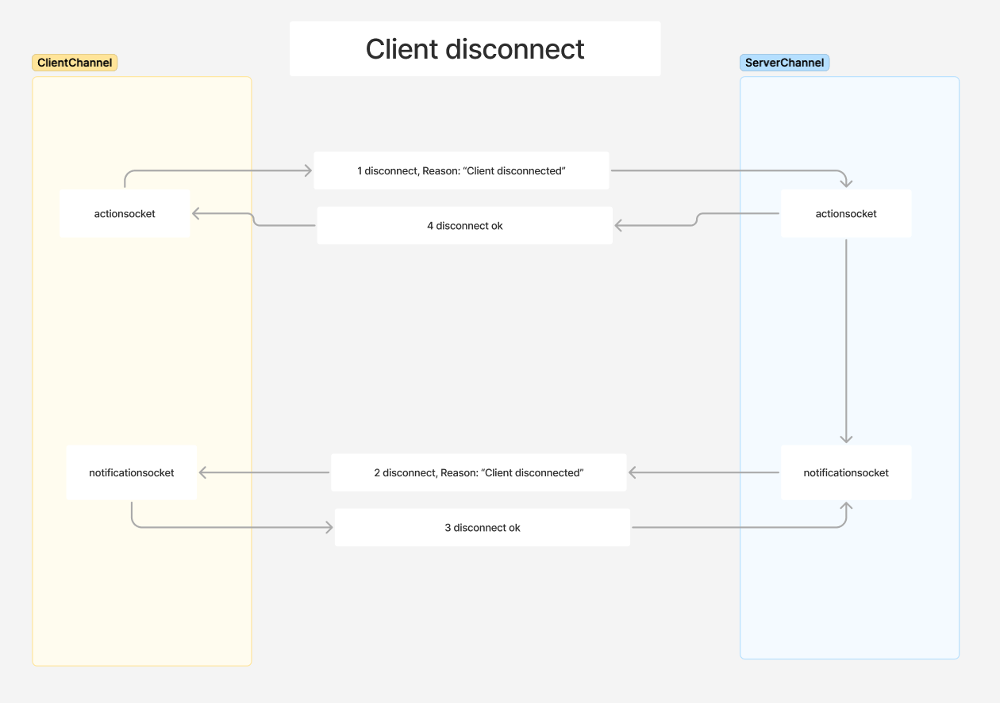
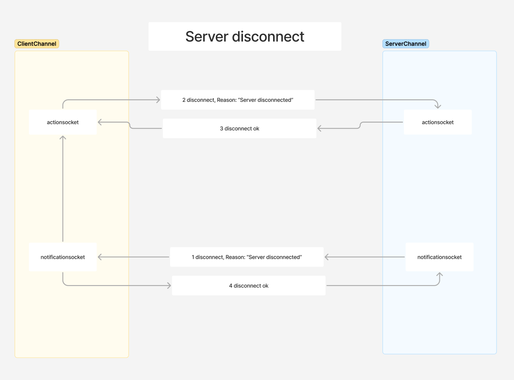

# deckster

Sketches can be found herre:
https://www.figma.com/board/y79q33tQc60CvPH8OGqBSD/Deckster?node-id=0-1&t=28XqJwUIr7WQSmtB-1

## Communication

Communication happens over 2 websockets:
1 action socket (request/response)
1 notification socket (asynchronous/push)

### Connect
Connection handshake are done in 2 parts:
- join (establish action socket)
- finish join (establish notification socket)

### Client disconnect
Disconnecting initiated by client:
- Client sends close message on action socket with message "Client disconnected" (important)
- Server sends close message on notification socket with message "Client disconnected"
- Client sends close response on notification socket
- Server sends close response on action socket

### Server disconnect
Disconnecting initiated by server:
- Server sends close message on notification socket with message "Server disconnected" (important)
- Client sends close message on action socket with message "Server disconnected"
- Server sends close response on action socket
- Client sends close response on notification socket

